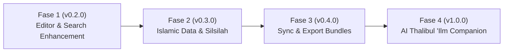

# 🗺️ Bayan — Fitur & Roadmap

> **Bayan (بَيَان)** adalah sistem ensiklopedia dan *Islamic Knowledge Graph* berbasis Markdown lokal untuk memetakan keterhubungan dalil, hukum syariat, konsep ushul, kitab rujukan, dan ulama secara interaktif.

Dokumen ini memaparkan seluruh fitur yang telah diimplementasikan dalam versi saat ini (**v0.1.0**) serta rencana strategis pengembangan (**Roadmap**) jangka pendek, menengah, dan panjang.

---

## 📑 Daftar Isi
- [Visi & Filosofi](#-visi--filosofi)
- [Fitur Utama Saat Ini (v0.1.0)](#-fitur-utama-saat-ini-v010)
  - [1. Interactive Knowledge Graph Canvas](#1-interactive-knowledge-graph-canvas)
  - [2. Tautan Dua Arah (Bidirectional Wikilinks & Backlinks)](#2-tautan-dua-arah-bidirectional-wikilinks--backlinks)
  - [3. Taksonomi & Manajemen Tipe Catatan Dinamis](#3-taksonomi--manajemen-tipe-catatan-dinamis)
  - [4. Metadata Frontmatter Spesifik Khazanah Islam](#4-metadata-frontmatter-spesifik-khazanah-islam)
  - [5. Editor Markdown Terpadu & Dual-Pane Preview](#5-editor-markdown-terpadu--dual-pane-preview)
  - [6. Command Palette Universal (Cmd+K / Ctrl+K)](#6-command-palette-universal-cmdk--ctrlk)
  - [7. File-System First & Obsidian Compatible](#7-file-system-first--obsidian-compatible)
- [Roadmap Pengembangan](#-roadmap-pengembangan)
  - [Fase 1: Pengayaan Editor & Penelusuran (v0.2.0)](#fase-1-pengayaan-editor--penelusuran-v020)
  - [Fase 2: Integrasi Sumber Data & Visualisasi Lanjutan (v0.3.0)](#fase-2-integrasi-sumber-data--visualisasi-lanjutan-v030)
  - [Fase 3: Kolaborasi, Sinkronisasi & Ekspor (v0.4.0)](#fase-3-kolaborasi-sinkronisasi--ekspor-v040)
  - [Fase 4: Islamic AI & Semantic Assistant (v1.0.0)](#fase-4-islamic-ai--semantic-assistant-v100)
- [Arsitektur & Spesifikasi Teknis](#-arsitektur--spesifikasi-teknis)

---

## 🌟 Visi & Filosofi

Dalam tradisi keilmuan Islam, sebuah hukum fiqih tidak berdiri sendiri. Fiqih berakar dari dalil (Al-Qur'an dan As-Sunnah), dirumuskan menggunakan kaidah ushul fiqih, dikembangkan oleh para mujtahid dan fuqaha, serta tercatat dalam kitab-kitab turats dari berbagai madzhab.

**Tujuan Bayan:**
1. **Memvisualisasikan Hubungan Ilmiah:** Menghubungkan setiap dalil, hukum, dan kaidah ke dalam graf visual sehingga rantai keterhubungan ilmu dapat dipahami secara utuh.
2. **Kemandirian & Privasi Data:** Data disimpan dalam bentuk berkas Markdown lokal murni (`.md`) dengan format terbuka tanpa keterikatan pada database tertutup (*vendor lock-in*).
3. **Ergonomi Thalibul 'Ilm:** Antarmuka modern yang cepat, mendukung tipografi teks Arab (RTL), pencarian instan via tombol keyboard, dan taksonomi yang dapat disesuaikan.

---

## ⚡ Fitur Utama Saat Ini (v0.1.0)

```
┌────────────────────────────────────────────────────────────────────────┐
│                                 BAYAN                                  │
│                                                                        │
│   ┌────────────────┐      ┌─────────────────┐      ┌───────────────┐   │
│   │ Knowledge Graph│◄────►│ Bi-directional  │◄────►│ Dynamic Note  │   │
│   │ 2D Canvas      │      │ Wikilinks [[]]  │      │ Taxonomy      │   │
│   └────────────────┘      └─────────────────┘      └───────────────┘   │
│           ▲                        ▲                       ▲           │
│           │                        │                       │           │
│   ┌───────┴────────┐      ┌────────┴────────┐      ┌───────┴───────┐   │
│   │ Islamic Schema │      │  Dual-Pane Live │      │ Command       │   │
│   │ & Frontmatter  │      │     Editor      │      │ Palette Cmd+K │   │
│   └────────────────┘      └─────────────────┘      └───────────────┘   │
└────────────────────────────────────────────────────────────────────────┘
```

### 1. Interactive Knowledge Graph Canvas
- **Visualisasi Berbasis Fisika (Force-Directed 2D):** Menggunakan simulasi partikel interaktif pada HTML5 Canvas murni untuk performa tinggi tanpa dependensi berat eksternal.
- **Pewarnaan Sesuai Tipe:** Setiap simpul (node) diwarnai secara dinamis mengikuti skema warna tipe catatan (misal: Dalil = hijau zamrud, Hukum = amber, Konsep = biru langit, Kitab = ungu, Tokoh = merah).
- **Interaktivitas Penuh:**
  - *Drag and Drop* untuk menata ulang posisi simpul secara langsung.
  - *Zoom in/out* (roda mouse / pinch gesture) dan *pan canvas*.
  - *Click to Navigate:* Mengklik node langsung membuka catatan terkait.
  - *Local Graph View:* Halaman catatan menyajikan graf relasi lokal khusus catatan tersebut beserta tetangga terdekatnya.
  - *Fullscreen Graph Mode:* Halaman graf khusus `/graph` untuk eksplorasi skala penuh.

### 2. Tautan Dua Arah (Bidirectional Wikilinks & Backlinks)
- **Sintaks Wikilinks Kompatibel:** Gunakan sintaks populer `[[Judul Catatan]]` atau `[[Target-Slug|Label Teks]]` langsung di dalam isi berkas Markdown.
- **Resolusi Otomatis:** Sistem secara otomatis mencocokkan target link berdasarkan *slug*, *title*, maupun path file.
- **Deteksi Backlinks Otomatis:** Setiap halaman catatan otomatis menampilkan bagian *"Dirujuk Oleh (Backlinks)"*, merinci seluruh catatan lain yang menyitir halaman tersebut tanpa perlu deklarasi manual.
- **Daftar Tautan Keluar (Outgoing Links):** Ringkasan semua topik yang ditautkan dari catatan aktif.

### 3. Taksonomi & Manajemen Tipe Catatan Dinamis
- **Katalog Tipe Fleksibel (`/settings`):** Konfigurasi tipe catatan yang tersimpan dalam format JSON terstruktur (`data/note-types.json`).
- **Tipe Bawaan (Default Types):**
  - `concept`: Ushul & Konsep Pokok (prinsip ushul fiqih, kaidah, definisi).
  - `hukum`: Hukum Syariat & Fiqih (wajib, sunnah, mubah, makruh, haram).
  - `dalil`: Dalil Al-Qur'an, Hadits Nabi, atau riwayat atsari.
  - `kitab`: Kitab Turats & Referensi karya ulama.
  - `tokoh`: Tokoh, Shahabat, Imam Madzhab, dan Fuqaha.
- **Kustomisasi Mandiri:** Tambah tipe baru (misal: `fatwa`, `kaidah-fiqh`, `istilah`), pilih palet warna visual, atur ikon dari katalog pustaka Lucide Icons, dan beri deskripsi.
- **Proteksi Hapus:** Tipe catatan yang sedang aktif digunakan oleh catatan tidak dapat dihapus secara tidak sengaja.

### 4. Metadata Frontmatter Spesifik Khazanah Islam
- **Frontmatter YAML Terstruktur:** Terintegrasi di bagian atas berkas Markdown dengan parser `gray-matter`.
- **Field Khusus Dalil:**
  - `source_type`: Al-Qur'an, Hadits, Ijma', Qiyas, atau Atsar.
  - `reference`: Nomor ayat atau referensi kitab hadits (misal: *HR. Bukhari No. 1*).
  - `grade`: Derajat sanad (*Shahih*, *Hasan*, *Dhaif*, dsb.).
  - `translation`: Terjemahan makna dalam bahasa Indonesia.
  - `narrator`: Perawi matan atau sanad.
- **Field Khusus Hukum & Fiqih:**
  - `status_hukum`: Ketetapan hukum syar'i.
  - `madzhab`: Madzhab rujukan (Syafi'i, Hanafi, Maliki, Hanbali, dll.).
  - `author` & `field`: Pengarang dan disiplin ilmu rujukan.
- **Dukungan Tipografi Arab (RTL):** Field `arabic` menampilkan teks ayat atau matan hadits dengan font serif elegan bernuansa kaligrafi dan tata letak *Right-to-Left*.

### 5. Editor Markdown Terpadu & Dual-Pane Preview
- **Editor Langsung:** Halaman `/notes/new` dan `/notes/[slug]/edit` menyediakan formulir terpadu untuk metadata dan teks dokumen.
- **Quick Toolbar:** Tombol pintas untuk menyisipkan sintaks `[[Tautkan Catatan]]`, kutipan matan dalil (`> `), dan sub-judul.
- **Kategori Auto-Suggest:** Input kategori dilengkapi *datalist* riwayat folder yang telah ada.
- **Pratinjau Markdown Real-time:** Beralih antara tab Editor dan Tab Pratinjau dengan render penuh (heading, tabel GFM, blockquote, formatting, dan tautan wikilinks interaktif).

### 6. Command Palette Universal (Cmd+K / Ctrl+K)
- **Akses Cepat dari Mana Saja:** Tekan `Cmd + K` (Mac) atau `Ctrl + K` (Windows/Linux) di layar mana pun.
- **Pencarian Multifaset:** Mencari judul catatan, isi ringkasan (*summary*), tagar (*tags*), serta teks Arab secara instan.
- **Filter Tipe Catatan:** Tab filter sekali-klik untuk menyaring hasil hanya pada Dalil, Hukum, Konsep, Kitab, atau Tokoh.
- **Navigasi Keyboard Penuh:** Dukungan `ArrowUp`, `ArrowDown`, `Enter` untuk membuka, dan `Esc` untuk menutup.

### 7. File-System First & Obsidian Compatible
- **Struktur Folder Terbuka:** Berkas disimpan langsung di direktori `content/` dengan struktur sub-folder sesuai kategori.
- **Interoperabilitas Obsidian / Logseq:** Berkas catatan menggunakan format Markdown baku dan YAML frontmatter standar, sehingga dapat dibuka langsung di aplikasi *knowledge base* lain tanpa migrasi rumit.

---

## 🚀 Roadmap Pengembangan



### Fase 1: Pengayaan Editor & Penelusuran (v0.2.0)
*Fokus: Mempermudah penulisan dan kecepatan menemukan keterkaitan catatan.*
- [ ] **Autocomplete Wikilinks Inline:** Memunculkan *popup suggestions* saat mengetik `[[` di dalam teks editor untuk langsung memilih catatan yang sudah ada.
- [ ] **Mesin Pencarian Full-Text (MiniSearch / FlexSearch):** Pengindeksan teks penuh dari seluruh isi catatan Markdown (bukan hanya metadata dan judul).
- [ ] **Tag Explorer & Visual Filter:** Halaman filter khusus berdasarkan tagar (`#fiqih`, `#ibadah`, `#zakat`) pada Knowledge Graph.
- [ ] **Pemberitahuan Broken Links (Unresolved Links):** Mendeteksi tautan `[[Catatan]]` yang berkasnya belum dibuat, dengan tombol pintas *"Buat Catatan Ini Sekarang"*.

### Fase 2: Integrasi Sumber Data & Visualisasi Lanjutan (v0.3.0)
*Fokus: Spesialisasi khazanah keilmuan Islam dan silsilah ilmiah.*
- [ ] **Pohon Silsilah Perawi & Sanad (Sanad Visualizer):** Diagram garis alur periwayatan hadits dari Rasulullah ﷺ melalui shahabat, tabi'in, hingga mukharrij hadits (Bukhari, Muslim, dsb.).
- [ ] **Quran & Hadith Quick Embed:** Fitur penyisipan instan ayat Al-Qur'an berdasarkan nomor surah dan ayat (misal: sintaks `{{quran:2:255}}`), mengambil teks Arab berharakat dan terjemahan Kemenag.
- [ ] **Matriks Perbandingan Madzhab (Muqaranah Mazahib):** Tampilan tabel komparasi hukum fiqih antar empat madzhab besar dalam satu halaman catatan.
- [ ] **Pilihan Font Kaligrafi Arab:** Pengaturan font Arab (Amiri Quran, Uthman Taha, Scheherazade New) dan ukuran harakat untuk kenyamanan membaca matan panjang.

### Fase 3: Kolaborasi, Sinkronisasi & Ekspor (v0.4.0)
*Fokus: Portabilitas catatan dan fleksibilitas ekosistem.*
- [ ] **Ekspor Graf ke Format Gambar (SVG / High-Res PNG):** Mengunduh tangkapan layar Knowledge Graph untuk materi presentasi atau kajian.
- [ ] **Sinkronisasi Otomatis Git (Git Auto-Sync):** Komit dan push otomatis perubahan catatan ke repositori GitHub pribadi.
- [ ] **Mode Membaca Khusus (Distraction-Free Reading Mode):** Tata letak baca terpusat dengan tipografi turats klasik untuk pengkajian kitab intensif.
- [ ] **Mode Cetak & Ekspor PDF Catatan:** Format cetak rapi dengan layout dokumen formal beserta catatan kaki (*footnotes*).

### Fase 4: Islamic AI & Semantic Assistant (v1.0.0)
*Fokus: Kecerdasan buatan lokal untuk asisten pencarian hukum dan korelasi konsep.*
- [ ] **Pencarian Semantik Berbasis Vektor (Local Embedding / RAG):** Menemukan catatan fiqih yang relevan berdasarkan pertanyaan bahasa alami meskipun kata kuncinya tidak sama persis.
- [ ] **Deteksi Otomatis Relasi Konsep:** Rekomendasi otomatis tautan antar catatan yang memiliki kemiripan topik atau dalil pendukung.
- [ ] **PWA & Offline Support:** Akses catatan secara penuh saat luring (tanpa koneksi internet) melalui Progressive Web App.

---

## 🛠️ Arsitektur & Spesifikasi Teknis

| Komponen | Teknologi | Keterangan |
| :--- | :--- | :--- |
| **Framework Utama** | Next.js 16 (App Router) | Server-side rendering dan API routes terpadu |
| **Pustaka UI** | React 19, Tailwind CSS v4 | Antarmuka responsif dan utilitas CSS modern |
| **Ikonografi** | Lucide React | Pustaka ikon universal untuk badge dan taksonomi |
| **Visualisasi Graf** | HTML5 Canvas 2D | Simulasi partikel gaya tolak/tarik mandiri |
| **Markdown Parser** | `gray-matter`, `react-markdown`, `remark-gfm` | Ekstraksi frontmatter YAML dan rendering Markdown |
| **Penyimpanan Data** | File-system (`content/*.md`, `data/note-types.json`) | Transparan, tanpa SQL/NoSQL yang rumit |
| **Bahasa Pemrograman** | TypeScript 5 | Tipifikasi ketat untuk integritas relasi graf |
